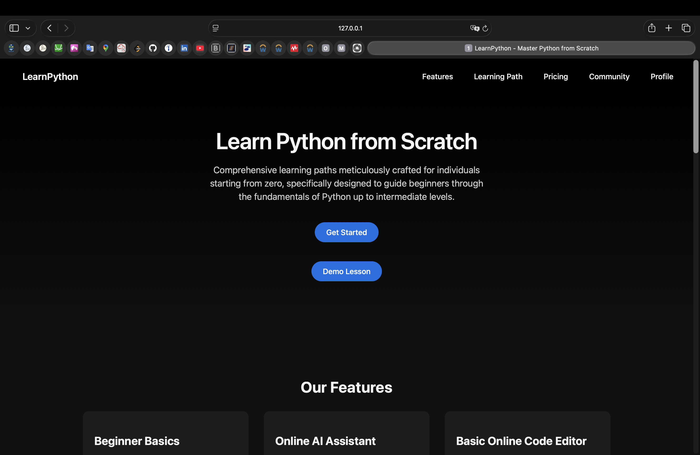
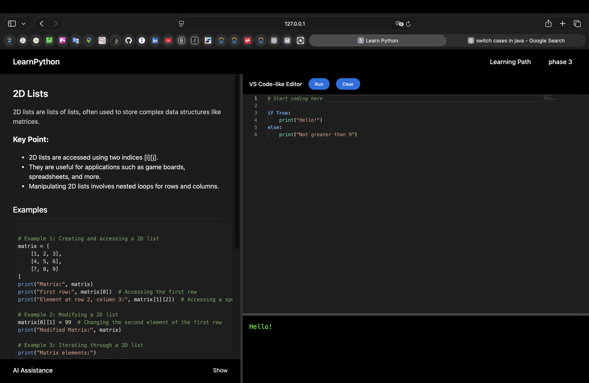
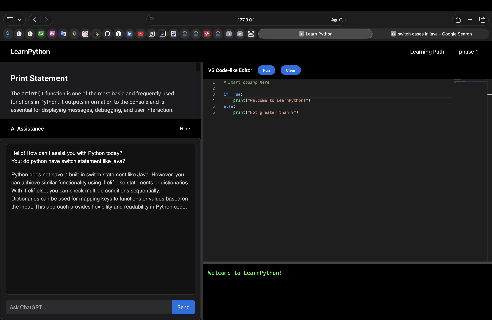

# Flask-LearnPython — Security-focused Flask learning platform
A Flask backend for an interactive Python-learning site with **tier-gated content**, **AI assistance**, and **safe user code execution via a separate sandbox service**.

This repo is a **defensive security learning project**: I focused on identifying trust boundaries, documenting threats, and implementing practical controls (rate limiting, CSRF, authentication gates, and sandbox isolation).

**Key security features**
- Session-based authentication + tier-based authorisation (free/premium)
- CSRF protection for browser flows (Flask-WTF) and explicit exemptions where appropriate (e.g., webhooks)
- Rate limiting for brute-force and abuse-prone routes (auth, AI, code execution, IPN)
- User-submitted Python is executed **outside the Flask process** (separate sandbox service + Docker isolation)
- CI-safe mode (`TESTING=true`) so tests run without production credentials

**Security docs (recommended)**
- `docs/SECURITY_OVERVIEW.md` — threat model + trust boundaries
- `docs/ATTACK_SURFACE.md` — route-by-route risks/mitigations
- `docs/SANDBOX_SECURITY.md` — why isolation matters for code execution


## Screenshots
### Home


### Learning page


### Chatgpt and Code execution



## Security focus
Built with a security-first mindset: define trust boundaries, document threats, and implement practical controls.

Implemented controls:
- Password hashing + session-based auth
- CSRF protection (Flask-WTF)
- Rate limiting (Flask-Limiter) on high-risk endpoints
- Input validation and payload limits
- Secrets loaded from env vars; CI runs without production credentials

Security design notes live in `/docs` (overview, attack surface, sandbox risks).


## Architecture (request flow)
Browser  
→ Flask app (auth, lessons, AI proxy, payments, access control)  
→ Supabase (Postgres) for user/tier data  
→ OpenAI API for AI assistance  
→ PayPal IPN for payment notifications  
→ Sandbox service for executing user-submitted Python

**Trust boundaries**
- All user input is untrusted at route boundaries
- User code is forwarded to a separate sandbox service (not executed inside Flask)


## Threat model (summary)
Threats considered:
- Brute-force / credential stuffing → rate limits on auth-related routes
- CSRF on state-changing endpoints → CSRF protection (with documented exceptions)
- Abuse of expensive endpoints (AI / code exec) → rate limits + daily usage limits
- RCE risk from user-submitted code → sandbox boundary + layered safeguards
- Webhook spoofing → server-side PayPal IPN verification

Detailed security notes: `/docs/SECURITY_OVERVIEW.md`, `/docs/ATTACK_SURFACE.md`, `/docs/SANDBOX_SECURITY.md`.


## Security controls implemented
- Password hashing (Werkzeug) + session-based auth
- CSRF protection (Flask-WTF)
- Rate limiting (Flask-Limiter) on sensitive routes (auth, AI, code exec, IPN)
- Input validation + payload limits
- Secrets loaded via env vars; CI runs without production credentials


## User code execution (security note)
User-submitted Python code is **not executed inside the Flask process**.  
The backend forwards code to a **separate sandbox service**, with layered safeguards:

Layers of control:
- Flask-side gates: login required, rate limits, max code length, request timeouts
- Sandbox authentication: Flask → sandbox requests include `X-SANDBOX-SECRET`
- Container isolation: per-run containers with network disabled and strict CPU/memory/PID/time limits

Important: blacklist/keyword filtering is **not** treated as a security boundary. Isolation comes from the container boundary.

## Features
Learning platform
- Structured lesson content served from JSON (`/content`)
- Tier-gated learning routes

Integrations
- OpenAI API for AI assistance
- Supabase (Postgres) for user storage and tier state
- PayPal IPN verification flow for subscription upgrades

User code execution
- `/run_code` forwards code to an external sandbox service
- Controls in Flask for /run_code: login required, rate limit, max code length (1000 chars), and a request timeout when calling the sandbox service.


## Tech stack
- **Backend:** Flask (Python 3.12)
- **DB:** Supabase (Postgres)
- **Auth:** Flask sessions + password hashing
- **Security:** Flask-WTF (CSRF), Flask-Limiter (rate limiting), Flask-CORS
- **AI:** OpenAI API
- **Payments:** PayPal IPN
- **CI:** GitHub Actions (runs pytest in CI-safe mode)


## Run locally
### Prereqs
- Python 3.12
- Redis (rate limiting storage)
- Docker (sandbox execution)

### 1. Start Redis
In a separate terminal:
```bash
redis-server
```

### 2. Build sandbox image
From repo root:
```bash
docker build -t python-sandbox ./sandbox
```

### 3. Start the sandbox service
In another separate terminal:
```bash
cd sandbox
python3.12 execution_service.py
```

### 4. Run the Flask app
From repo root:
```bash
python3 -m venv venv
source venv/bin/activate
pip install -r requirements.txt
python3.12 app.py
```

Open: `http://127.0.0.1:5000`


## Environment variables
This project loads environment variables from `password.env` in the project root and `secret.env` in ./sandbox.

Create `password.env` and `secret.env` (example values only):

password.env
```env
OPENAI_API_KEY="sk-example"
SUPABASE_URL="https://example.supabase.co"
SUPABASE_API_KEY="example_key"
PAYPAL_CLIENT_ID
PAYPAL_CLIENT_SECRET
WEBHOOK_ID="example"
MAIL_PASSWORD="gmail_app_password"
SANDBOX_SECRET="dev-only-change-me"
SECRET_KEY="dev-only-change-me"
```

secret.env
```env
SANDBOX_SECRET="dev-only-change-me"
```


## Testing + CI
Run tests: `pytest`

Current tests focus on defensive behaviour (auth input validation, login-required gates, run_code limits).
CI runs pytest with TESTING=true so external services (Supabase/OpenAI) are not required.


## Project Structure
```bash
Flask-Learnpython/
├── .github/workflows
├── content/
├── docs/
├── static/
├── templates/
├── tests/
├── app.py
├── requirements.txt
```


## Limitations & next steps
Limitations:
- Single-file Flask app (app.py)
- Tests exist, but broader integration coverage (auth/payment flows) is still limited

Next steps:
- Account lockout / progressive delays after repeated failed logins
- Password strength policy + email verification
- Expand integration tests (auth, PayPal IPN flow, sandbox boundary)
- Strengthen sandbox isolation guarantees


## Author
Built by **Kong Yu Min**  
University of Glasgow  
Python | Backend | Security